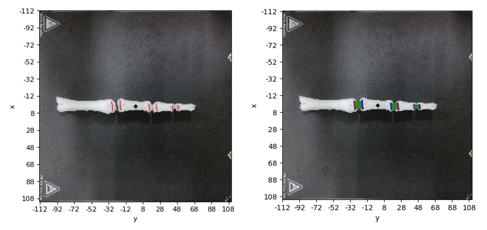

# Marker Connector

Marker Connector is an image processing project that identifies and connects markers between sponges in an image using advanced techniques. 
The program uses clustering, linear regression, and customizable visualization methods for precise and efficient marker linking.

## Features

- Detect and process markers on images.
- Connect markers with dynamically adjustable parameters.
- Visualize connections using OpenCV and Matplotlib.
- Built with robust algorithms like K-Means clustering and Linear Regression.

## Installation

To run this project, you need to install the required Python packages:

```bash
pip install opencv-python numpy matplotlib scikit-learn ipywidgets notebook
```

## Usage

1. Clone the repository and navigate to the project folder.
2. Run the Jupyter Notebook using the following command:

   ```bash
   jupyter notebook marker_connector.ipynb
   ```

3. Follow the instructions in the notebook to load your image and adjust parameters for marker detection and connection.

## Libraries Used

- OpenCV: For image processing and drawing marker connections.
- NumPy: For numerical computations and data manipulation.
- Matplotlib: For visualizing results.
- Scikit-learn: For clustering and regression.
- ipywidgets: For dynamic parameter adjustment in Jupyter Notebook.

## Project Workflow

1. **Preprocessing**: Load the image and preprocess it for marker detection.
2. **Marker Detection**: Use clustering algorithms to identify markers.
3. **Connection Algorithm**: Establish connections between markers based on proximity or other criteria.
4. **Visualization**: Display the connected markers with clear visual outputs.

## Example

Here’s an example of the input image and its corresponding output image:



## Contributing

Feel free to submit issues or contribute to the project by creating pull requests.

## License

This project is licensed under the MIT License.
